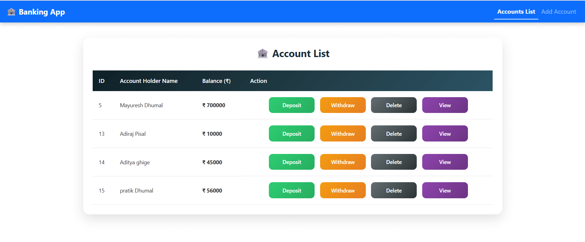
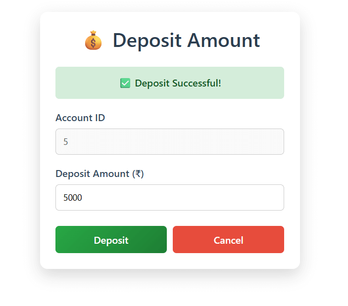
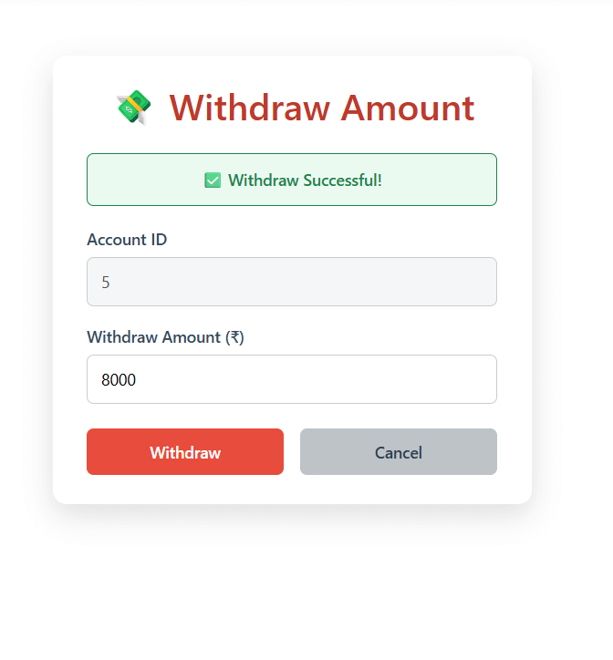
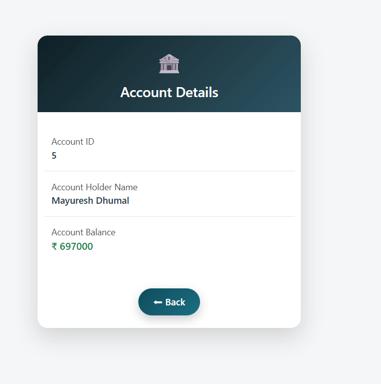

# 🏦 Bank Management System

A full-stack **Bank Management System** developed using **Angular** for the frontend and **Spring Boot** for the backend.  
This application provides core banking features such as account creation, deposits, withdrawals, and account management through a clean and responsive UI.

---

## 🚀 Features
- Create new bank accounts  
- View all accounts  
- View account details  
- Deposit money  
- Withdraw money  
- Delete account  
- RESTful API integration  

---

## 🛠️ Tech Stack

### Frontend
- Angular  
- TypeScript  
- HTML5  
- CSS3  

### Backend
- Java  
- Spring Boot  
- Spring Data JPA  

### Database
- MySQL  

---


---

## 📸 Screenshots

### Account List


### Create Account


### Deposit Money


### Withdraw Money


### View Account Details


---

## ⚙️ How to Run the Project

### Backend (Spring Boot)
1. Open backend project in IDE  
2. Configure database in `application.properties`  
3. Run the Spring Boot application  

### Frontend (Angular)
1. Navigate to `frontend` folder  
2. Install dependencies  
   ```bash
   npm install


